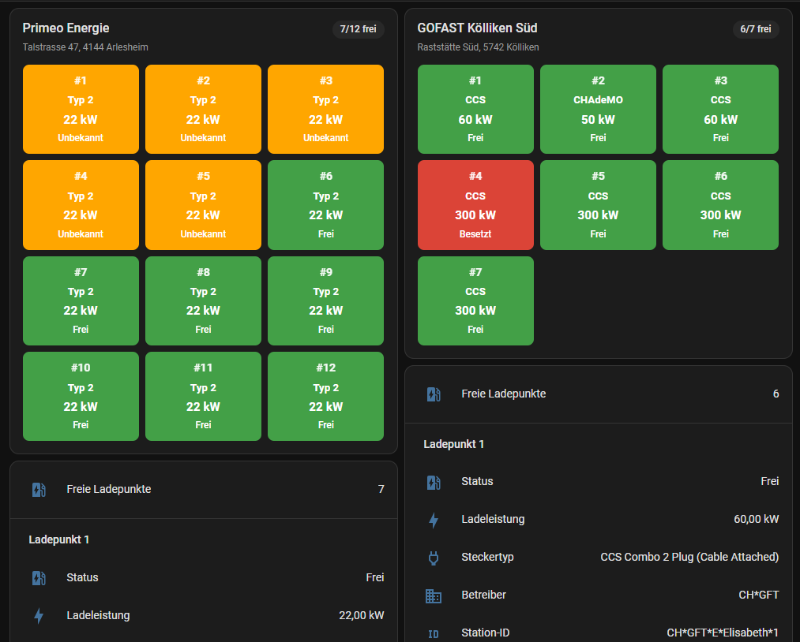

# Swiss Charging Stations (ich-tanke-strom.ch)

[](https://github.com/hacs/integration)
[](LICENSE)

A Home Assistant custom integration that shows real-time availability of public EV charging stations in Switzerland, sourced from the official **ich-tanke-strom.ch** platform (BFE / EnergieSchweiz / swisstopo).

## Background

ich-tanke-strom.ch operates a public WFS/GeoServer API covering roughly **19,000 charging points** across Switzerland, with live status (available / occupied / out of service) for each one — no authentication required. This integration offers two independent ways to use that data, chosen when you add the integration:

- **Radius overview** — every station within a configurable radius around a location, each as a `geo_location` entity so they show up automatically on any Map card, plus live-adjustable filters.
- **Favorite station** — pin exactly one specific charge point you care about (e.g. your regular charger), independent of any location or radius. Repeatable — add the integration again for another favorite.
- **Favorite site** — pin an entire physical charging site (all its charge points combined into one device), useful for sites with several connectors at the same address. Repeatable, same as above.

## What it provides

### Radius overview

| Entity | Type | Description |
|---|---|---|
| `geo_location.ladestation_...` | Geo-location | One per matching charging station. State = distance from your configured location (km). Attributes: status, power (kW), plug types, operator, address, opening hours, payment options. Localized status label shown on the map via `label_mode: attribute`. |
| `sensor.charging_stations_available_<radius>km` | Sensor | Count of currently available stations matching the active filters within the radius. Attributes include totals, active filter values, and the plug types/operators found in range. |
| `number.charging_stations_min_power_kw` | Number | Minimum power filter (kW) — e.g. set to 50 to only show fast chargers. Takes effect immediately. |
| `select.charging_stations_plug_type` | Select | Plug type filter, options discovered dynamically from stations in range (e.g. CCS, Type 2, CHAdeMO). |
| `select.charging_stations_status` | Select | Availability filter: all / available only / occupied only. |
| `select.charging_stations_operator` | Select | Operator filter, options discovered dynamically from stations in range. |

Filter changes via the `number`/`select` entities apply immediately — no waiting for the next poll. Data is refreshed every 5 minutes.

### Favorite station

| Entity | Type | Description |
|---|---|---|
| `sensor.charging_station_favorite_<name>` | Sensor | Current status (available / occupied / out of service). |
| `sensor.charging_station_favorite_<name>_power_kw` | Sensor | Charging power (kW), as its own graphable sensor. |
| `sensor.charging_station_favorite_<name>_plug_type` | Sensor | Plug type(s) available at the station. |
| `sensor.charging_station_favorite_<name>_operator` | Sensor | The station's operator. |
| `sensor.charging_station_favorite_<name>_station_id` | Sensor | The station's EvseID (diagnostic). |

A pre-filled card listing all five is also added automatically to a "Favorites" view on the [automatic dashboard](#automatic-dashboard).

### Favorite site

| Entity | Type | Description |
|---|---|---|
| `sensor.charging_station_favorite_location_<name>` | Sensor | State = number of currently available charge points at the site. Attributes: total charge point count, address, and a `connectors` list with each charge point's own status, power (kW), and plug type. |
| `sensor.charging_station_favorite_location_<name>_connector_<n>_status` | Sensor | Current status of connector `<n>` at the site (available / occupied / out of service). |
| `sensor.charging_station_favorite_location_<name>_connector_<n>_power_kw` | Sensor | Charging power (kW) of connector `<n>`. |
| `sensor.charging_station_favorite_location_<name>_connector_<n>_plug_type` | Sensor | Plug type(s) of connector `<n>`. |
| `sensor.charging_station_favorite_location_<name>_connector_<n>_operator` | Sensor | Operator of connector `<n>`. |
| `sensor.charging_station_favorite_location_<name>_connector_<n>_station_id` | Sensor | The connector's own EvseID (diagnostic). |

One set of these five per connector is created automatically (e.g. a site with 6 connectors gets 6×5 = 30 connector sensors, plus the summary sensor above). A pre-filled card listing all of them (status/power/plug type per connector) is also added automatically to a "Favorites" view on the [automatic dashboard](#automatic-dashboard).

Favorites (station or site) intentionally have no `geo_location` map marker — the radius overview already covers map display, so a favorite is tracked purely via its sensors, keeping the map free of clutter.

All favorite entities refresh live (every 5 minutes), independent of any radius overview you may also have configured.

## Bundled Lovelace card

The integration ships its own Lovelace card, `swiss-charging-stations-card`, showing colored per-connector status boxes — green for available, red for occupied, gray for out of service — each box with the connector's plug type (abbreviated, e.g. "CCS" for CCS Combo 2), charging power, and status. It works for both favorite kinds: a whole site shows one box per connector plus an available/total badge; a single favorite station shows one box.



The card registers itself automatically (no manual resource setup) and is used on the auto-generated "Favorites" dashboard view. It is also available in the card picker as **Swiss Charging Stations Card** for use anywhere else:

```yaml
type: custom:swiss-charging-stations-card
entity: sensor.charging_station_favorite_location_<name>  # or a single favorite's status sensor
title: My charging site  # optional
```

## Language

Entity names, the device name, and the dropdown filter values adapt automatically to your Home Assistant language setting — German, English, French, and Italian are supported, with English as the fallback for any other language. Raw plug type / operator names from the source data are shown as-is (they are not translatable identifiers).

## Automatic dashboard

On first setup, the integration automatically creates a **"Charging Stations"** dashboard (title localized to your HA language) with a full-screen native Home Assistant Map card, already configured to display each station's status directly on its marker. This only happens once: if you later customize or delete that dashboard yourself, the integration won't touch it again.

Favoriting a station or a whole site adds a second view, **"Favorites"**, to that same dashboard with a pre-filled Entities card per favorite — feel free to edit or delete it, though it's kept in sync with the favorite's current connectors on every restart.

## Installation

### HACS (recommended)

1. In HACS, go to **Integrations → ⋮ → Custom repositories**, add this repository URL with category **Integration**.
2. Search for **"Swiss Charging Stations"** and install.
3. Restart Home Assistant.

### Manual

1. Copy the `custom_components/ich_tanke_strom` folder into your Home Assistant `config/custom_components/` directory.
2. Restart Home Assistant.

## Setup

1. Go to **Settings → Devices & Services → Add Integration**.
2. Search for **"Swiss Charging Stations (ich-tanke-strom.ch)"**.
3. Choose a mode:
   - **Radius overview**: latitude/longitude default to your Home Assistant home location, set the radius (km). Done — add the integration again for a different location or radius. Adjust the filters afterwards via the `number`/`select` entities.
   - **Favorite station**: enter the station's EvseID directly (e.g. from a QR code on the charger, or looked up on ich-tanke-strom.ch), or leave it empty and search near a location instead — optionally narrowed by minimum power and plug type — then pick one from the resulting list. The list also includes whole sites (marked with 📍 and their charge point count) alongside individual connectors — pick one of those instead to favorite the entire site. Add the integration again for another favorite.

## Notes

- Only relevant for locations in or near Switzerland.
- Data quality/freshness varies by charging network operator — some feeds update within minutes, others less frequently. This reflects the operators' own reporting, not a limitation of this integration.
- This integration is unofficial and not affiliated with, endorsed by, or supported by the BFE, EnergieSchweiz, swisstopo, or ich-tanke-strom.ch. It only reads their published Open Data.
- If the source API is unreachable, entities simply stop updating rather than showing incorrect data.

## Data source & license

This integration reads live data from the official ich-tanke-strom.ch WFS API. Citing the source is required whenever this data is displayed — see [NOTICE.md](NOTICE.md) for details. Every entity sets Home Assistant's `attribution` attribute accordingly.

## Disclaimer

This integration is provided **as-is, without any warranty**. Data is retrieved from a third-party published source and may be inaccurate, delayed, incomplete, or unavailable. Do not rely on it as your sole source for trip planning or safety-critical decisions — always verify availability directly at the charging station or via the operator's own app before relying on it. The author(s) accept **no responsibility or liability** for any damage, financial loss, incorrect readings, or other issues arising from using this integration, whether it stops working, behaves unexpectedly, or never worked correctly for your setup in the first place.

## License

Source code: MIT — see [LICENSE](LICENSE). Charging station data: see [NOTICE.md](NOTICE.md) for the required attribution.
