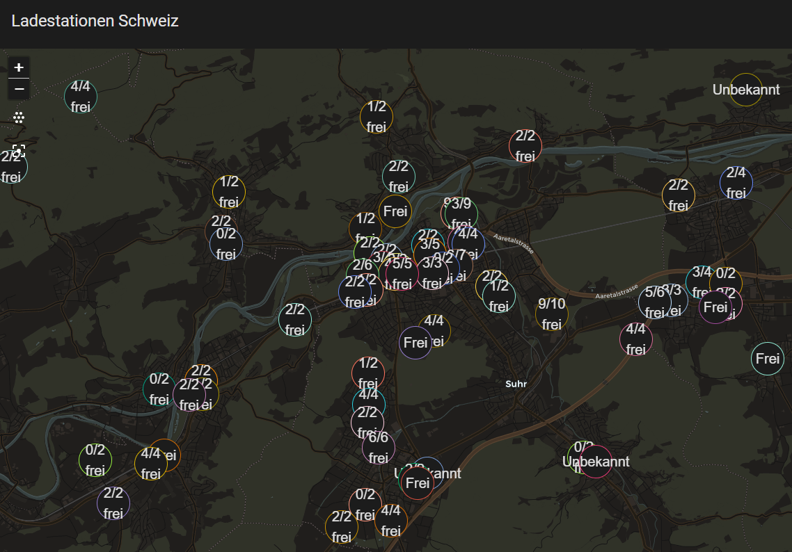

# Swiss Charging Stations (ich-tanke-strom.ch)

[](https://github.com/hacs/integration)
[](LICENSE)
<a href="https://www.buymeacoffee.com/prusuino"></a>

A Home Assistant custom integration that shows real-time availability of public EV charging stations in Switzerland, sourced from the official **ich-tanke-strom.ch** platform (BFE / EnergieSchweiz / swisstopo).

## Background

ich-tanke-strom.ch operates a public WFS/GeoServer API covering roughly **19,000 charging points** across Switzerland, with live status (available / occupied / out of service) for each one — no authentication required. This integration offers two independent ways to use that data, chosen when you add the integration:

- **Radius overview** — every station within a configurable radius around a location, each as a `geo_location` entity so they show up automatically on any Map card, plus live-adjustable filters.
- **Favorite station** — pin exactly one specific charge point you care about (e.g. your regular charger), independent of any location or radius. Repeatable — add the integration again for another favorite.
- **Favorite site** — pin an entire physical charging site (all its charge points combined into one device), useful for sites with several connectors at the same address. Repeatable, same as above.

## What it provides

### Radius overview

| Entity | Type | Description |
|---|---|---|
| `geo_location.charging_station_...` (English) / `geo_location.ladestation_...` (German) — see [Addressing the map markers](#addressing-the-map-markers) | Geo-location | One per matching charging **site** (connectors at the same location are grouped, so multi-charger sites don't stack indistinguishable markers). State = distance from your configured location (km). The map label shows availability — "6/7 available" for multi-connector sites, the plain status for single chargers — refreshed live on every update; the marker goes unavailable while the data source is unreachable. Attributes: available/total count, max power (kW), plug types, operator, address, opening hours. |
| `sensor.charging_stations_available_<radius>km` | Sensor | Count of currently available stations matching the active filters within the radius. Attributes include totals, active filter values, the plug types/operators found in range, and `available_by_plug_type` — the available count per plug type as a dictionary. |
| `sensor.charging_stations_available_<radius>km_<plug>` | Sensor | Optional, one per plug type selected in the integration's **Configure** dialog (e.g. `..._ccs2`, `..._type2_cable`): count of available charge points offering that plug type. Respects the minimum-power and operator filters but ignores the live plug-type/status filters — filtering the map to Type 2 doesn't zero your "free CCS" count. |
| `number.charging_stations_min_power_kw_<radius>km` | Number | Minimum power filter (kW) — e.g. set to 50 to only show fast chargers. Takes effect immediately. |
| `select.charging_stations_plug_type_<radius>km` | Select | Plug type filter, options discovered dynamically from stations in range (e.g. CCS, Type 2, CHAdeMO). |
| `select.charging_stations_status_<radius>km` | Select | Availability filter: all / available only / occupied only. |
| `select.charging_stations_operator_<radius>km` | Select | Operator filter, options discovered dynamically from stations in range. |

`<radius>` is the entry's radius in km — `sensor.charging_stations_available_15km`, `select.charging_stations_status_15km` — so the entities of two radius entries stay apart. These are the ids suggested when an entity is first created; the filter entities of a radius entry set up with version 1.9 or earlier keep the ids they already have (without the radius suffix), and any entity can be renamed in its settings at any time.

Filter changes via the `number`/`select` entities apply immediately — no waiting for the next poll. Data is refreshed every 5 minutes.

The per-plug-type sensors are enabled in the integration's **Configure** dialog (Settings → Devices & services → Swiss Charging Stations → Configure): a multi-select of the plug types found in the Swiss network. Selecting or deselecting a type adds or removes its sensor immediately, no restart needed.

The radius is capped at **30 km**: larger areas make the source server slow (20–40+ seconds per fetch) and would flood Home Assistant with thousands of entities. Independently of the radius, at most the **500 nearest sites** get a map marker — the availability count sensor always covers the full filtered set.

#### Addressing the map markers

The map markers are the one kind of entity without a fixed entity id: Home Assistant derives the object id from the entity's name, and that name is localized. The same site is `geo_location.ladestation_50kw_migros_aarau` on a German instance and `geo_location.charging_station_50kw_migros_aarau` on an English one (French `geo_location.borne_de_recharge_…`, Italian `geo_location.stazione_di_ricarica_…`). A card or template written against one language finds nothing on the other, so do not address markers by entity id — use their `source` attribute, which is always `ich_tanke_strom`:

- **Map card** — `geo_location_sources` draws every marker of this integration (also the ones hidden from the auto-generated overview) and follows sites as they come and go, and it can put the live availability on the marker label:

  ```yaml
  type: map
  geo_location_sources:
    - source: ich_tanke_strom
      label_mode: attribute
      attribute: status
  ```

- **Templates** — filter the `geo_location` domain on the `source` attribute instead of naming entities:

  ```jinja
  {{ states.geo_location
     | selectattr('attributes.source', 'eq', 'ich_tanke_strom')
     | selectattr('attributes.count_available', 'gt', 0)
     | map(attribute='name') | list }}
  ```

  This lists the sites in range with at least one free charger, in any language.

### Favorite station

| Entity | Type | Description |
|---|---|---|
| `sensor.charging_station_favorite_<name>` | Sensor | Current status (available / occupied / out of service). |
| `sensor.charging_station_favorite_<name>_power_kw` | Sensor | Charging power (kW), as its own graphable sensor. |
| `sensor.charging_station_favorite_<name>_plug_type` | Sensor | Plug type(s) available at the station. |
| `sensor.charging_station_favorite_<name>_operator` | Sensor | The station's operator. |
| `sensor.charging_station_favorite_<name>_station_id` | Sensor | The station's EvseID (diagnostic). |
| `sensor.charging_station_favorite_<name>_price` | Sensor | The published ad-hoc (direct payment) price, e.g. "0.57 CHF/kWh" — kept as the source's free-text since some operators add time components ("+ 0.25 CHF/Min (> 1h)"). Only about a quarter of Swiss sites publish a price; the rest show a localized "Not published". Raw value (or none) as a `price` attribute. See [Data source & license](#data-source--license). |

The [dashboard strategy](#dashboard) below lays all of them out for you, without you building a card by hand.

### Favorite site

| Entity | Type | Description |
|---|---|---|
| `sensor.charging_station_favorite_location_<name>` | Sensor | State = number of currently available charge points at the site. Attributes: total charge point count, `available_by_plug_type` (available count per plug type as a dictionary), derived site status, address, and a `connectors` list with each charge point's own status, power (kW), and plug type. |
| `sensor.charging_station_favorite_location_<name>_available_<plug>` | Sensor | One per plug type present at the site (e.g. `..._available_ccs2`, `..._available_chademo`): number of currently available charge points offering that plug type — free CCS vs free CHAdeMO at a mixed site. Created automatically. |
| `sensor.charging_station_favorite_location_<name>_status` | Sensor | Derived overall site status: available / occupied / **closed** (every connector out of service at a non-24h site — i.e. outside opening hours) / out of service (same, but at a 24h site). Localized state; raw `site_status` attribute for automations. |
| `sensor.charging_station_favorite_location_<name>_connector_<n>_status` | Sensor | Current status of connector `<n>` at the site (available / occupied / out of service). |
| `sensor.charging_station_favorite_location_<name>_connector_<n>_power_kw` | Sensor | Charging power (kW) of connector `<n>`. |
| `sensor.charging_station_favorite_location_<name>_connector_<n>_plug_type` | Sensor | Plug type(s) of connector `<n>`. |
| `sensor.charging_station_favorite_location_<name>_connector_<n>_operator` | Sensor | Operator of connector `<n>`. |
| `sensor.charging_station_favorite_location_<name>_connector_<n>_station_id` | Sensor | The connector's own EvseID (diagnostic). |
| `sensor.charging_station_favorite_location_<name>_price` | Sensor | The site's published ad-hoc price — same behavior as the single-favorite price sensor above. |

One set of these five per connector is created automatically (e.g. a site with 6 connectors gets 6×5 = 30 connector sensors, plus the summary sensor above). The [dashboard strategy](#dashboard) below renders the site's summary and per-connector state without you building a card by hand.

Favorites (station or site) intentionally have no `geo_location` map marker — the radius overview already covers map display, so a favorite is tracked purely via its sensors, keeping the map free of clutter.

All favorite entities refresh live (every 5 minutes), independent of any radius overview you may also have configured.

## Bundled Lovelace card

The integration ships its own Lovelace card, `swiss-charging-stations-card`, showing colored per-connector status boxes — green for available, red for occupied, gray for out of service, blue while the site is closed (outside its opening hours), yellow when the operator reports no usable status — each box with the connector's plug type (abbreviated, e.g. "CCS" for CCS Combo 2), charging power, and status. Clicking a box opens the connector's more-info dialog.

The header shows the site name, its address, the weekly opening hours with consecutive days collapsed ("Mon–Fri 08:00–20:00 · Sat 07:30–18:00", or "Open 24 h"; omitted when the source has no schedule data), and the published price ("0.57 CHF/kWh"; omitted when the operator publishes none). Up to three uniform badges stack vertically in the corner:

- **Availability** — "3/8 available" (green while at least one connector is free, red when all are taken), switching to "Closed" outside opening hours, "Closed today" on full-day closures, or "Out of service" when nothing at the site is in service.
- **Accessibility** (gray-blue) — the source's access declaration: "Publicly accessible", "Restricted access", or "Paid access" (localized). Also exposed as `accessibility` (raw) and `accessibility_text` attributes on the favorite status and site overview sensors.
- **Renewable energy** (dark green leaf) — shown when the operator declares green power; for a whole site only when no connector explicitly reports otherwise. Also exposed as a `renewable_energy` attribute on the favorite status sensor and per connector (`renewable`) in the site overview's `connectors` attribute.

Each badge can be hidden individually via the visual editor (`hidden_badges` in YAML).

It works for both favorite kinds: a whole site shows one box per connector; a single favorite station shows one box.


### Adding the card as a resource

The integration serves the card file, but registering it as a Lovelace resource is left to you — the resource list is part of your dashboard configuration, and an integration has no business writing into it. It is a one-time step:

**Settings → Dashboards → ⋮ (top right) → Resources → + Add resource**

| Field | Value |
|---|---|
| URL | `/ich_tanke_strom_files/swiss-charging-stations-card.js` |
| Resource type | JavaScript module |

Then reload the page (Ctrl/Cmd+Shift+R). The same file also contains the [dashboard strategy](#dashboard), so this one resource covers both.

Afterwards the card appears in the card picker as **Swiss Charging Stations Card**, with a visual editor for all options:

```yaml
type: custom:swiss-charging-stations-card
entity: sensor.charging_station_favorite_location_<name>  # or a single favorite's status sensor
title: My charging site  # optional
plug_types:  # optional: show only these plug types (multi-select in the visual editor)
  - CCS Combo 2 Plug (Cable Attached)
hidden_badges:  # optional: hide individual header badges (availability / accessibility / renewable)
  - accessibility
```

With a `plug_types` filter, boxes of other plug types are hidden and the availability badge counts only the visible connectors (e.g. "1/2 available" for just the CCS chargers of a mixed site). The filter is purely visual — the favorite and its sensors keep covering the whole site.

## Language

Entity names, the device name, and the dropdown filter values adapt automatically to your Home Assistant language setting — German, English, French, and Italian are supported, with English as the fallback for any other language. Raw plug type / operator names from the source data are shown as-is (they are not translatable identifiers).

## Dashboard

The integration ships a **dashboard strategy**: a recipe Home Assistant renders in the browser, rather than a dashboard written into your configuration. Nothing is stored, nothing is overwritten, and the result follows your setup — add a favorite and it appears on the next page load; delete one and it is gone, with no leftover card.

Requires the card [registered as a resource](#adding-the-card-as-a-resource) (the strategy ships in the same file). Then:

1. **Settings → Dashboards → + Add dashboard → New dashboard from scratch**, give it a name.
2. Open it, then **✏️ (edit) → ⋮ → Raw configuration editor**.
3. Replace the entire content with:

```yaml
strategy:
  type: custom:swiss-charging-stations
views: []
```

4. Save.

You get:

- a **Map** view — every station in range on a full-screen map, each marker labeled with its live availability (only shown when a radius search is configured);
- a **Charging stations** view — the radius search with its filter controls first, then one section per favorite: the bundled card with its per-connector status boxes, plus that favorite's headline sensors as tiles.



The strategy also appears under **+ Add dashboard** as *Swiss Charging Stations*, which does the same thing without the raw editor.

Everything the strategy produces is a normal Home Assistant dashboard. If you would rather arrange things yourself, build your own dashboard with the bundled card and the entities above — the strategy is an offer, not a requirement.


### Adjusting the strategy

A strategy dashboard has no card editor — the layout is generated fresh on every load. You still have two ways to shape it without giving that up:

**Options.** Anything you add under `strategy:` is passed to the recipe:

```yaml
strategy:
  type: custom:swiss-charging-stations
  title: My title
  max_columns: 3
views: []
```

| Option | Effect |
|---|---|
| `title` | dashboard title |
| `max_columns` | column count of the generated section views |
| `map: false` | leave out the full-screen map view |

**One view inside your own dashboard.** Instead of a separate dashboard, let the strategy fill a single view of one you already have. Open your dashboard's raw configuration editor and add a view:

```yaml
views:
  - title: Home
    # ... your own cards ...
  - title: Swiss Charging Stations
    strategy:
      type: custom:swiss-charging-stations
```

That view is regenerated like the full dashboard is, so new config entries still appear by themselves, while every other view stays yours to edit. The same options work here too.

> **Take control** (⋮ menu) turns a strategy dashboard into a static one you can edit card by card — but it is one-way: the dashboard stops following your config entries from then on. Prefer the two approaches above.

## Installation

### HACS (recommended)

1. Open **HACS**, search for **"Swiss Charging Stations"** and download it — or use the button, which opens the integration directly in your HACS:

   [](https://my.home-assistant.io/redirect/hacs_repository/?owner=prusuino&repository=ha_swiss_charging_stations&category=integration)

2. Restart Home Assistant.

Until the integration shows up in the HACS search, the button above adds it as a custom repository.

### Manual

1. Copy the `custom_components/ich_tanke_strom` folder into your Home Assistant `config/custom_components/` directory.
2. Restart Home Assistant.

## Setup

1. Go to **Settings → Devices & Services → Add Integration**.
2. Search for **"Swiss Charging Stations (ich-tanke-strom.ch)"**.
3. Choose a mode:
   - **Radius overview**: latitude/longitude default to your Home Assistant home location, set the radius (km). Done — add the integration again for a different location or radius. Adjust the filters afterwards via the `number`/`select` entities.
   - **Favorite station**: enter the station's EvseID directly (e.g. from a QR code on the charger, or looked up on ich-tanke-strom.ch) — the same field also accepts a whole-site ChargingStationId, creating a favorite site directly — or leave it empty and search near a location instead — optionally narrowed by minimum power and plug type — then pick one from the resulting list. The list also includes whole sites (marked with 📍 and their charge point count) alongside individual connectors — pick one of those instead to favorite the entire site. Add the integration again for another favorite.

4. Optional: register the [bundled card](#adding-the-card-as-a-resource) as a resource and set up the [dashboard](#dashboard). The integration works fully without it — this only saves you building the cards yourself.

## Notes

- Only relevant for locations in or near Switzerland.
- Data quality/freshness varies by charging network operator — some feeds update within minutes, others less frequently. This reflects the operators' own reporting, not a limitation of this integration.
- This integration is unofficial and not affiliated with, endorsed by, or supported by the BFE, EnergieSchweiz, swisstopo, or ich-tanke-strom.ch. It only reads their published Open Data.
- If the source API is unreachable, the sensors and map markers become unavailable instead of showing stale data.

## Data source & license

This integration reads live data from the official ich-tanke-strom.ch WFS API. Citing the source is required whenever this data is displayed — see [NOTICE.md](NOTICE.md) for details. Every entity sets Home Assistant's `attribution` attribute accordingly.

Charging prices come from a second source: the ["Ladepreiskarte Swiss eMobility"](https://opendata.swiss/de/dataset/ladepreiskarte-swiss-emobility) open dataset (price atlas by Swiss eMobility / chargeprice.app), as republished by the SFOE in the charging-station layer on data.geo.admin.ch — the same values ich-tanke-strom.ch and map.geo.admin.ch display. Prices are the operators' published ad-hoc (direct payment) rates, not contract or roaming tariffs, and only exist for operators that report them (roughly a quarter of all Swiss sites). They are fetched at most every 6 hours; a price fetch failure never affects the availability data.

## Disclaimer

This integration is provided **as-is, without any warranty**. Data is retrieved from a third-party published source and may be inaccurate, delayed, incomplete, or unavailable. Do not rely on it as your sole source for trip planning or safety-critical decisions — always verify availability directly at the charging station or via the operator's own app before relying on it. The author(s) accept **no responsibility or liability** for any damage, financial loss, incorrect readings, or other issues arising from using this integration, whether it stops working, behaves unexpectedly, or never worked correctly for your setup in the first place.

## License

Source code: MIT — see [LICENSE](LICENSE). Charging station data: see [NOTICE.md](NOTICE.md) for the required attribution.

## Related integrations

More Home Assistant integrations from the same author:

- [Swiss Waters](https://github.com/prusuino/ha_swiss_waters) — live water temperature, water level, discharge and flood danger levels of Swiss rivers and lakes
- [Austrian Charging Stations](https://github.com/prusuino/ha_austrian_charging_stations) — real-time availability of public EV charging stations in Austria
- [Swiss Transport](https://github.com/prusuino/ha_swiss_transport) — live public-transport departure boards and saved connections
- [Swiss Parking](https://github.com/prusuino/ha_swiss_parking) — live free parking spaces in Swiss cities
- [Swiss Electricity Price](https://github.com/prusuino/ha_swiss_electricity_price) — electricity tariffs of any Swiss grid operator (ElCom)
- [Swiss Solar Reference Price](https://github.com/prusuino/ha_swiss_solar_reference_price) — the Swiss solar reference market price (SFOE)
- [Swiss Earthquakes](https://github.com/prusuino/ha_swiss_earthquakes) — recent Swiss earthquakes on the built-in map
- [Swiss Public Alerts](https://github.com/prusuino/ha_swiss_public_alerts) — official Swiss public alerts (Alertswiss) with home-location matching
- [Swiss Avalanche Bulletin](https://github.com/prusuino/ha_swiss_avalanche_bulletin) — the official SLF avalanche bulletin for your location
- [Innoxel Master 3](https://github.com/prusuino/ha_innoxel_master3) — local control of the Innoxel Master 3 home-automation system

## Support

If this integration is useful to you, you can support its development:

<a href="https://www.buymeacoffee.com/prusuino"></a>
